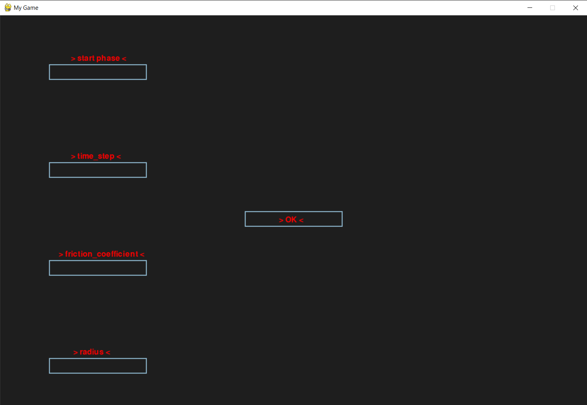
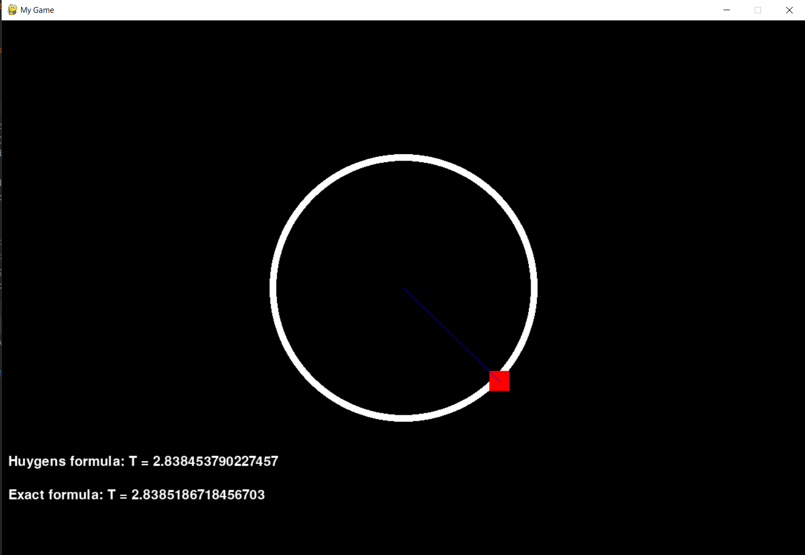

# mathematical-pendulum-python-pygame
friction-aware mathematical pendulum on pygame without using third-party libraries. All physics was written completely from scratch

## Application features
- It is possible to choose the initial angle of pendulum oscillation
- You can select the frame rate of frame drawing when oscillating
- It is possible to choose the friction coefficient for the pendulum
- You can choose the length of the pendulum (radius of the circle)

## Screenshots of the app

